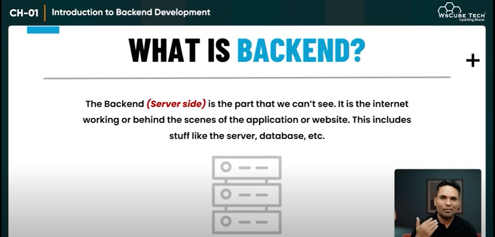
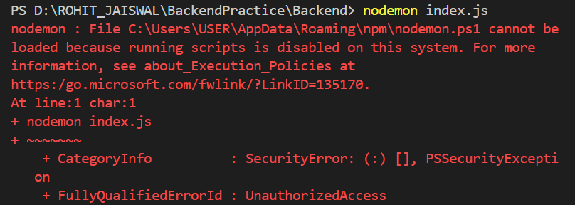

# Introduction to Backend Development.
## What is Backend ?


## What is the workflow of the Backend ?
Req -- Data from frontend ---> through API ---> to the Server/Backend
Res -- Matched data from the server ---> through API ---> displaying on the web page

## What are the responsibilities of the backend developer ?
1) They write server side code.
2) They write code to internet with a database like MongoDB.
3) They ensure that the server side code is secure and free of bugs.
4) They ensure that the server side code is optimized enough to handle large volume of traffics.

## Which tech and databases are used in the backend ?
1) NodeJs (JavaScript) -- Express Js
2) PHP -- Laravel
3) Python -- dJango, Flask
4) Java -- 
5) Ruby --
6) C# --

Database : SQL (MySQL) and NoSQL (MongoDB).

# Introduction to NodeJs and NPM.
## Node Js
NodeJs is an open-source and Javascript runtime environment. NodeJs runs the V8 JS engine, the core of Google Chrome, outside of the browser.

### Installation of NodeJs: 
1) Download the NodeJs (LTS) form the official website. LTS--Long Term Support.
2) Install the NodeJs in your system. 
3) Open the terminal and run the command (node -v). It will display the version of the NodeJs. If it happen that means Nodejs installed successfully in your local system.
4) Also check the version of the NPM and NPX (npm -v) (npx -v). 

## Make first program in NodeJs 
1) create the package.json file by running the command "npm init -y" in your terminal of the recent folder.

## Working Nodemon package
Nodemon provide the facility of auto start the server. No need to stop and start again the server if you make some changes in the code.

Installation Nodemon globally in your system -- npm i -g nodemon

Note : After installing the nodemon globally you must run the command "Set-ExecutionPolicy RemoteSigned -Scope CurrentUser" in window powershell. Without this permission nodemon is not able to run on your computer and the error wiil be occur.


---> You can also run the program through "npm start" by setting the script on the package.json file.

## Module in NodeJs
1) Core Modules : Built-in modules provided by node.js such as fs, http, path, etc.

2) Local Modules : Custom Modules created by developers and located within the project.

3) Third-party modules : Modules installed via npm.

By default it uses common.js module (require). See the addCartModule.js file for clarification.

# Create server in NodeJs
```js
// Create the node  server---------------
let http = require('http');
let server = http.createServer((req, res) => {
    res.end("Hi There....");
});
server.listen("8000");  // http//localhost:8000
```

# Express Js Introduction and Installation.
---> Express.js is a lightweight and flexible Node.js web application framework. It simplify building web applications and APIs by providing a robust set of features.

### Features: 
1) **Routing:** Define application routes using HTTP methods (GET, POST, PUT, DELETE, etc). Supports dynamic and nested routes.

2) **Middleware:** Functions executed in the req-res cycle.

3) **Templating:** Integrates with templating engine like EJS, Pug, handlebars to generate dynamic HTML.

4) **RESTful API support:** Ideal for creating RESTful services with clean and organized code. Simplify handling JSON and form data.

**Structure your project with MVC for maintenability**

To install the express: run "npm i express"

---> **Setup the express server in index file**
```js
const express = require('express');
const app = express();

app.get('/', (req, res) => {
    res.send("Express server done.");
})

app.listen("8000");
```

## Routing, Routing Params (Request and Response)
If we want to send the data securely, we use post method. You can store large amount of data using post method.

we can send req in 3 ways :
1) Body meyhod
2) Query method
3) using params (dynamic routing)

## Middleware
---> Middleware stand between the request and response. It is used for verify the token. It has three parameters : req, res and next.

## What is .env ? setup and run .env file in node.
It store the environment variable for better security. For configuration you must install the dotenv package in your terminal. npm i dotenv
To access the .env in your app, you must add the script 'require("dotenv").config();'
"process" keyword is used to access the data from .env file.